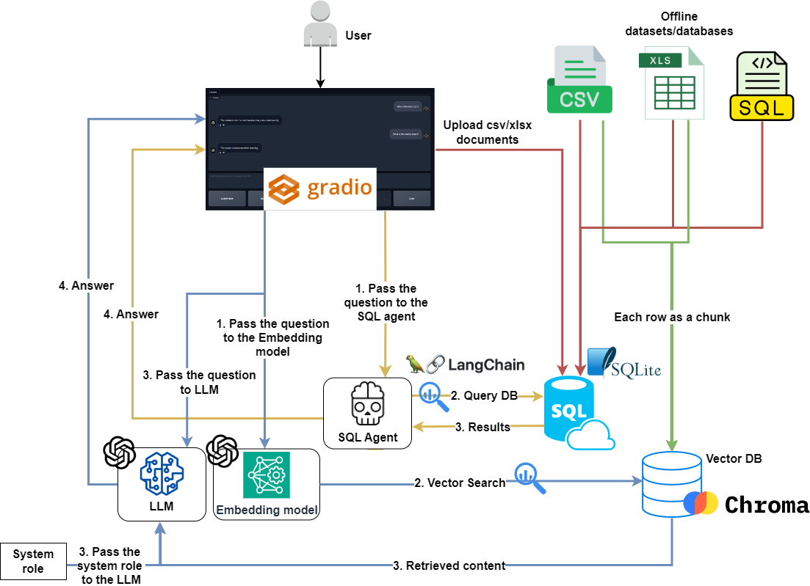

# Ask Any Questions on Your Uploaded Tabular Data 😃  

A chatbot powered by **GPT-3.5**, **Langchain**, **SQLite**, and **ChromaDB**, enabling **Q&A** and **RAG** interactions with SQL databases, CSV, and XLSX files using natural language.  

**Purpose:** To develop an **Agentic RAG-based system** with modular, well-structured code, following best coding practices, and integrating databases for seamless end-to-end deployment.

## ⚠ Key Note
- **Use only READ-access SQL databases** to prevent unintended data manipulation.

## 🚀 Features
- Chat with SQL, CSV, and XLSX data.
- RAG-based retrieval for tabular datasets.
- Upload and interact with datasets via UI.

## 🔬 Techniques Used
- LLM chains & agents
- GPT function calling
- Retrieval-Augmented Generation (RAG)

## 🛠 Requirements
- Linux or Windows (WSL recommended)
- OpenAI/Azure OpenAI API key
- Python & dependencies

## 📌 Installation
```sh
sudo apt update && sudo apt upgrade
python3 -m venv env
source env/bin/activate
pip install -r requirements.txt
```

## ⚡ Setup & Execution
1. **Prepare SQL Database** (from `.sql` file):
```sh
sqlite3 data/sqldb.db
.read data/sql/<database>.sql
```
2. **Convert CSV/XLSX to SQL DB**:
```sh
python src/prepare_csv_xlsx_db.py
```
3. **Create VectorDB from CSV/XLSX**:
```sh
python src/prepare_csv_xlsx_vectordb.py
```
4. **Upload & Chat with Data**:
   - Switch chat mode to `Process files`, upload data, wait for confirmation.
   - Switch back to `Chat`, set RAG mode to `Uploaded files`.
   - Start chatting!

## 🏗 Project Schema
<div align="center">
  
</div>

## Chatbot User Interface
<div align="center">
  
</div>

## 💻 Chatbot UI


## 📚 Sample Databases
- [Diabetes dataset](https://www.kaggle.com/datasets/akshaydattatraykhare/diabetes-dataset)
- [Cancer dataset](https://www.kaggle.com/datasets/rohansahana/breast-cancer-dataset-for-beginners)
- [Chinook database](https://database.guide/2-sample-databases-sqlite/)

## 🏗 Key Libraries
- [Langchain](https://python.langchain.com/docs/get_started/introduction)
- [Gradio](https://www.gradio.app/docs/interface)
- [OpenAI API](https://platform.openai.com/docs/quickstart?context=python)
- [SQLAlchemy](https://www.sqlalchemy.org/)

## 📜 License
MIT License

